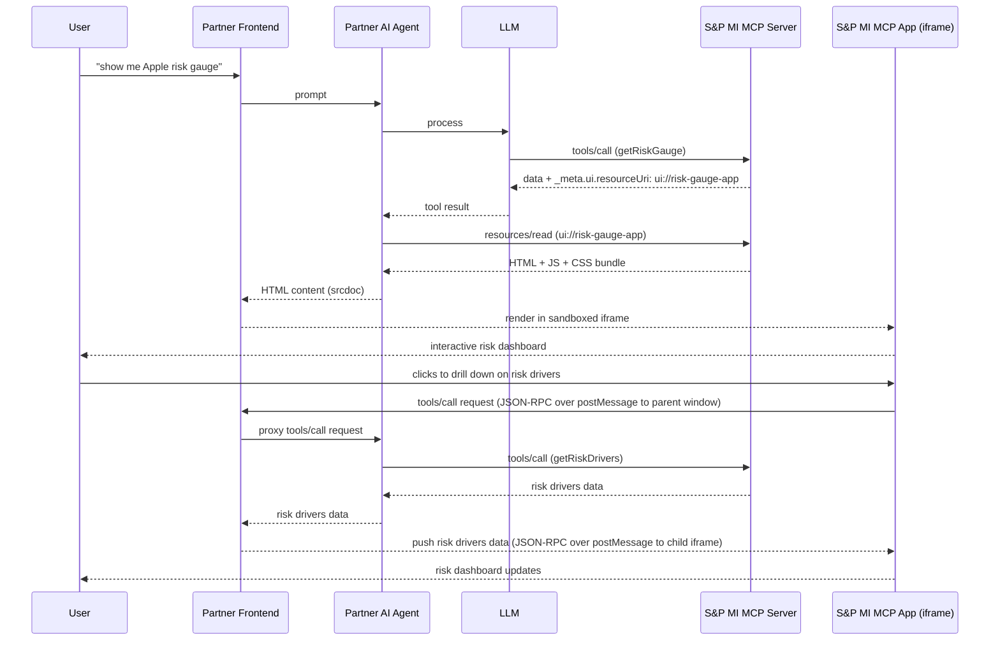

### 1. Simple vs Complex Query Handling

- Distinguishing deterministic (simple, low-cost) queries from non-deterministic (complex, agent-driven) ones
- Routing strategy: rule-based / retrieval-based answers vs full LLM reasoning chains
- Avoiding unnecessary token burn for queries that can be resolved with direct lookup or navigation
- UX implications: response latency and interaction model differ between the two paths

---

### 2. Navigation

- Prompt-based navigation as a replacement or complement to menu/drill-down UX
- Mapping natural language intent to existing app surfaces, reports, and data views
- Deep-linking into legacy web apps from the chat interface
- Handling ambiguity: when a prompt could map to multiple destinations

---

### 3 Rendering Strategy: Pre-built vs Generic vs Declarative UI

- **Pre-built renderers**: custom visualisations for specific datasets (e.g. credit risk heatmaps, ownership treemaps) - high fidelity, high maintenance cost
- **Generic renderers**: reusable chart/table components driven by structured data - flexible but lower specificity
- **Declarative / Generative UI**: AI-emitted UI descriptions rendered at runtime (e.g. A2UI patterns) - dynamic but requires guardrails
- Decision framework for choosing the right rendering approach per use case
- Hybrid strategies and fallback chains

---

### New 3

- The north star principle: **LLM = intent, planning and explanation; APIs = data retrieval; UI = visualisation and interaction.** MCP/agents should act as the control plane, not the data transport
- Three patterns emerge - each with distinct cost, performance and UX trade-offs: (A) Data Plane - All-in Agent, (B) Control Plane - Hybrid, (C) Two-Stage Bounded Summarisation

---

### New 3.4 Approach C - Two-Stage Bounded Summarisation

A hybrid of the two: deterministic data is fetched outside the LLM via Approach B, but the model is additionally given a *bounded* subset - aggregates, anomalies, or key statistics - and generates a narrative alongside the rendered data.

- **Stage 1**: Hybrid retrieval fetches the full dataset outside the model; UI renders it as a chart or table
- **Stage 2**: Model receives a small computed subset (top rows, deltas, anomalies) plus pointers to the full dataset, and generates narrative insights with citations
- Combines the **determinism and performance** of Approach B with the **explanatory value** of Approach A
- Cost is controlled because the LLM receives only what it needs to reason - not the full payload
- Aligns naturally with a "conversational analytics" UX: chart and explanation rendered side by side, with the user able to ask follow-up questions about either

**Best for**: scenarios where users want both the data and a narrative explanation ("what changed this quarter?"); high-value synthesis where AI-generated insight adds genuine value; cases where cost control matters but pure Approach B feels too transactional

---

### 4.1 A2UI Overview

#### Overview

- Agent-to-UI (A2UI): AI agents emit structured JSON schemas describing UI components rather than raw HTML or markdown
- The schema defines component type, layout, data bindings, and interaction handlers — all resolved at render time
- A frontend rendering layer validates the schema against a contract, then maps component types to concrete design system components
- Supports streaming: partial schemas can be rendered progressively as the agent response arrives
- Stateless by design — each agent response describes a self-contained UI fragment; state lives in the frontend shell
- Versioned schema contracts decouple agent output from frontend component evolution

#### Where we would use this

- Dynamically composing dashboards that combine results from multiple datasets
- Agent selects the best representation based on the data shape
- Reducing the need for pre-built components for every possible data combination
- Personalised layouts based on user persona, context or stated preferences
- Composing custom views through natural language without developer intervention

---

### 4.3 A2UI vs Other Rendering Approaches

| Approach | Fidelity | Flexibility | Dev Effort | Agent Intelligence Required | Best For |
|---|---|---|---|---|---|
| **Pre-built renderer** | High | Low | High upfront | Low | Flagship views for stable, well-known datasets |
| **Generic renderer** | Medium | Medium | Medium | Low | Standard charts and tables driven by any structured data |
| **Declarative / A2UI** | Variable | High | Low per view | High | Dynamic combinations, novel layouts, ad-hoc queries |
| **Direct navigation** | N/A | Low | Low | Low | Known routes and simple deterministic lookups |

- These approaches are not mutually exclusive — a single response can combine a pre-built renderer for a known chart type with A2UI for the surrounding layout
- The decision primarily hinges on how well-defined the output shape is at design time vs runtime

---

### 5.1 MCP Apps Overview

MCP Apps (extension to MCP spec) enables MCP servers to return **interactive HTML interfaces**, not just structured data. This can be used as mechanism for surfacing rich financial UIs directly inside partner and customer platforms.

**The key distinction from plain MCP**: a standard MCP tool call returns structured data that the LLM incorporates into a text-based answer. An MCP Apps-enabled tool additionally returns a reference to a `ui://` resource — a self-contained HTML/JS/CSS application — that the host renders as an interactive UI embedded in the conversation.

#### How it works

- Each MCP Apps-enabled tool declares a `_meta.ui.resourceUri` field in its description, pointing to a `ui://` resource on the S&P MI MCP server
- When the tool is called, the host (partner platform) fetches that resource — a bundled HTML+JS+CSS app — and renders it in a **sandboxed iframe** within the conversation
- The iframe is strictly isolated from the host's page: it cannot access the parent DOM, cookies, or local storage
- All communication between the app and host passes through **postMessage** (JSON-RPC) — a restricted, auditable channel; no direct function calls
- **Bidirectional**: the embedded app can request further tool calls (e.g. a user clicks a company → app requests drill-down data), and the host pushes the results back into the app
- Content Security Policy (CSP) headers, derived from domains declared by the S&P MI MCP server, restrict which external origins the app may load resources from — default is `default-src 'none'` (least privilege)

#### Why iframe sandboxing?

- Partners render S&P MI-provided HTML inside their own platforms — the sandbox guarantees the app cannot escape its container, access user credentials, or interfere with the host page
- Only capabilities explicitly declared in the app's permissions manifest are granted — everything else is blocked by default
- Every app–host interaction passes through a logged JSON-RPC channel, making behaviour auditable and restricting injection vectors
- **Authentication is handled entirely at the agent-to-server boundary**: the partner AI agent authenticates with the S&P MI MCP server (e.g. via API key or OAuth token); the MCP App iframe carries no credentials and requires none — all data arrives via postMessage from the partner frontend, which proxied it from the agent. This is a significant simplification over traditional cross-vendor iframe integrations, where the embedded app must authenticate independently — typically requiring token injection into the iframe, cross-origin OAuth flows, and client-side credential management, all of which add complexity and security surface area

#### Where we would use this

- Delivering interactive financial dashboards (credit risk heatmaps, company tearsheets, ownership charts) directly into a customer's AI chat interface — no tab-switching, no separate login
- Enabling in-conversation drill-down: user asks a question, gets an interactive chart, clicks an entity to load detail — the app fires further tool calls on demand without a new prompt
- Real-time market data monitoring — the iframe maintains a live connection, updating displayed metrics as data changes
- Embedding rich document viewers (PDF filings, research reports) that are impractical as text responses
- Multi-step workflows requiring persistent state: screener tools, comparison tables, approval or review flows

---

### 5.2 MCP Apps Architecture

- The `ui://` resource is a self-contained app bundle — it can be preloaded by the host before the tool is even called, enabling streaming of tool inputs into the app
- The host constructs CSP headers from domains declared by the MCP server; undeclared origins are blocked — the server cannot widen these constraints at runtime
- The partner platform never needs to understand S&P MI's underlying APIs — it only speaks the MCP Apps protocol; the MCP server handles all data translation
- New S&P MI data products can be delivered to all partner platforms simply by publishing a new MCP server — no changes required on the partner side

---

### 6. Authentication, SSO & Entitlements *(suggested)*

- Single sign-on across previously siloed web apps — the literal "single door"
- Entitlement-aware rendering: UI must reflect per-customer product licensing (not just auth, but what data/features are visible)
- Token propagation from frontend session to agent calls to downstream data APIs
- UX for access-denied states: graceful degradation vs upsell prompts

---

### 7. Streaming & Progressive Rendering

- UX patterns for streaming AI responses: skeleton states, partial content reveals, thinking indicators
- Rendering strategy when the response type is not yet known (text? table? chart?)
- Handling multi-step agent responses: showing intermediate steps vs final output only
- Error and timeout handling mid-stream

---

### 8. Conversation & Session Management *(suggested)*

- Persisting conversation history: per-user, per-topic, or per-dataset context
- Resuming, branching, and forking conversations
- Sharing conversations or specific responses (e.g. sharing a synthesised report with a colleague)
- Context window management: what gets carried forward across turns vs truncated

---

### 9. Human-in-the-Loop & Trust Signals *(suggested)*

- Financial data accuracy stakes: surfacing confidence levels, data sources, and caveats inline
- Correction and feedback flows: allowing users to flag incorrect AI outputs
- Citation and provenance: linking AI-synthesised answers back to underlying datasets
- Escalation paths: when the front door should route to a human or to a legacy verified report

---

### 10. Frontend Architecture & Extensibility

- How existing product teams onboard their data products into the front door without a full rewrite
- Module federation, plugin model, or micro-frontend patterns
- Shared design system and component library strategy across products
- Governance: who owns the shell, who owns the plugins
