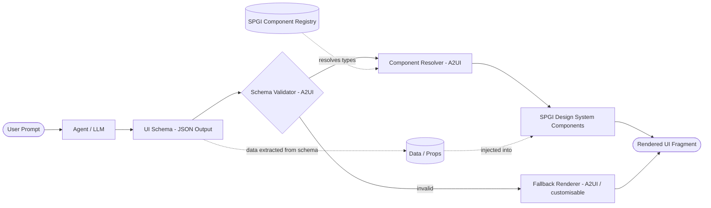
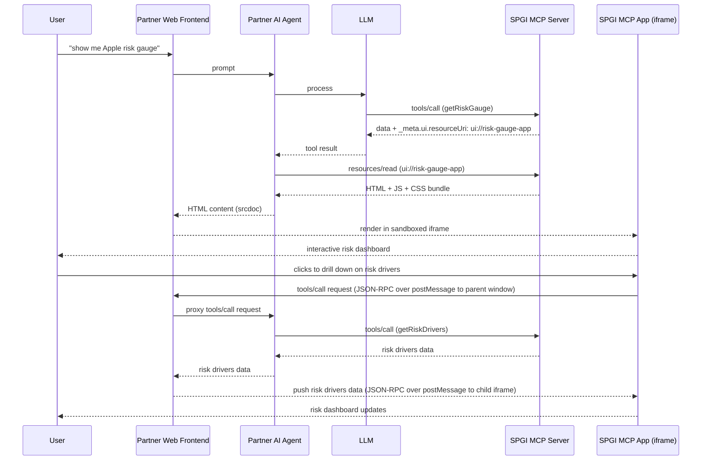

# Single Front Door

## High-Level AI / UI Integration Topics

### 1. Query Handling & Navigation

#### Query Handling

- Distinguishing deterministic (simple, low-cost) queries from non-deterministic (complex, agent-driven) ones
- Routing strategy - rule-based / retrieval-based answers vs full LLM reasoning chains
- Avoiding unnecessary token burn for queries that can be resolved with direct lookup or navigation
- Rendering Strategy - Pre-built vs Generic vs Declarative UI (e.g. A2UI) **TODO - This could be expanded to be a section in its own right**
- Upsell / cross-sell opportunities e.g. previews of complementary, related products / datasets

#### Navigation

- Prompt-based navigation to complement traditional menu / drill-down UX
- Mapping natural language intent to existing app components / dashboards / reports
- Handling ambiguity - a prompt might map to multiple destinations
- In the short-term, could also support deep-linking into legacy web apps from the chat interface

### 2. Performance

- Users expect visual interfaces to be highly performant for data selection, filtering, sorting, etc. operations
- However, when using issuing complex prompts to AI agent chat interfaces with text-based responses, user performance expectations tend to be lower.
- **Hence there are significant UX implications when exposing rich visual interactive interfaces in AI agent platforms. Response latency and interaction models differ markedly between deterministic and non-deterministic queries. There is a real risk of creating a mismatch in performance expectations.**

---

### 3. Token Burn - Data Plane vs Control Plane

#### 3.1 Overview

- The Single Front Door is likely to serve two fundamentally different query types:
  - **Non-deterministic** - synthesis and summarization across sources. This leverages LLM reasoning
  - **Deterministic** - structured dataset retrieval (repeatable, exact, can be large).
- **The architecture choice for each query type has significant cost, performance and reliability implications**
- The query types can be handled by two contrasting patterns:
  - **Data Plane** - where raw data flows through the LLM. The agent calls MCP tools, data is inserted into LLM context, LLM returns data to the frontend
  - **Control Plane** - LLM decides what to fetch and resolves parameters. Data bypasses the LLM and is retrieved directly by the frontend via traditional data APIs
- When raw data flows through the LLM, **token costs scale directly with payload size** - e.g. 365-day multi-series dataset can consume thousands of input tokens with no reasoning benefit from the LLM processing it
- Latency - beyond the cost implications, routing deterministic data through an LLM:
  - adds latency - tool orchestration, model turns, streaming serialization
  - can risk data integrity - reformatting, accidental transformation
- Single Front Door could select the most appropriate pattern based on the query type e.g.
  - large amounts of data, interactivity, drill down, etc. - don't stream the dataset through the LLM.
  - interpreting, synthesizing, summarizing or comparing - use the LLM, fed with bounded, well-chosen evidence and clear provenance

---

### 3.2 Data Plane Approach

The agent calls MCP tools, raw data is inserted into the LLM context, and the LLM returns the result directly to the frontend.

#### Pros
- Simple model e.g. prompt -> agent fetches -> agent answers
- Works well for small payloads and synthesis tasks

#### Cons
- Token cost and latency both scale with payload size
- Risk of formatting loss, or accidental data transformation by the LLM
- Difficult to support rich interactive components e.g. charts, drill-downs, filters, etc.

#### Use Cases
- Small bounded payloads .e.g. single records, small / filtered datasets, top 10 rows, etc.
- Tasks where natural-language output is the primary goal e.g. explain, summarize, compare, generate insights

#### Open Questions

- How can Single Front Door infer that data plane is the right approach?
  - Certain tools might always lend themselves to a data plane approach.
  - But for other tools, it might depend what parameters they are called with e.g. where parameters have a key bearing on tool response size (rows / bytes) and typical token usage.

---

### 3.3 Control Plane Approach

The LLM infers intent and resolves parameters, returning a query plan as structured JSON. The frontend (or BFF) executes the query plan by calling traditional data APIs directly. The end result is that the bulk data never touches the LLM.

#### Pros
- Predictable token cost - model only sees parameters, not payload
- Fast and cacheable data retrieval via optimised APIs
- Schemas stay intact end-to-end. Rich interactive visuals behave like a regular analytics product

#### Cons
- More complex than Data Plane Approach. In particular, needs a clean contract between intent -> query plan and query plan -> API calls + UI components
- **Non-trival challenges around standardized query semantics across data sources** e.g. parameter names, filter syntax, etc.
- Might require a translation layer between query plan params and data API params.

#### Use Cases
- Large datasets e.g. 365-day time series, multi-series charts, etc.
- Anything requiring strong determinism and audit trails
- Interactions that will be filtered, sorted or exported repeatedly

#### Considerations - Query Plan

The LLM will need to produce a structured JSON object containing:
- Datasource / tool identifier and resolved entity IDs (e.g. instrument, etc.)
- Fields, metrics, time range, granularity and filters
- Desired visual component type e.g. table, chart, heatmap, etc.
- Decision record - what the LLM decided and why

---

### 3.4 Two-Stage Bounded Summarization Approach

**TODO - Consider adding a third approach here, where the data is fetched outside the LLM but the model is given a bounded subset e.g. key statistics, etc.**

---

### 4.1 A2UI - Overview

#### Overview

- A2UI (Agent-to-UI) enables Declarative UIs, by allowing AI agents to dynamically compose UIs at runtime
- Instead of relying on a pre-built UI components or emitting raw HTML, agents emit structured JSON schemas describing interface they want rendered, based on the query data shape
- The schema defines component type, layout, data bindings, and interaction handlers - all resolved at render time
- Frontend rendering layer validates schema and maps types to concrete design system components
- Supports streaming - partial schemas can be rendered progressively as the agent response arrives
- Stateless by design - each agent response describes a self-contained UI fragment
- Created by Google with contributions from CopilotKit
- Reached v0.8 as of Feb 2026
- Huge potential, but still very new

#### Where and why we would use this

- Dynamically compose custom views and dashboards that combine results from multiple datasets
- Agent selects the best representation based on the data shape
- Reduce the need to develop and maintain pre-built components for every possible data combination
- Personalised layouts based on user persona, context or stated preferences

---

### 4.2 A2UI - Architecture



- Agent never emits raw HTML - all output passes through schema validation before anything renders
- Component Registry is the contract boundary - agents can only reference components that exist in it
- Data and props are embedded directly in the schema by the agent - the agent fetches data first and includes the values inline in the schema output; the rendering layer extracts and injects them into components at render time
- Data and props are injected at render time, keeping the schema itself lightweight
- Fallback renderer handles graceful degradation when schema is malformed or references an unknown component

---

### 4.3 A2UI - Rating Card Example

 Agent composes through component structure - prominent properties are expressed via `CardHeader` (rendered large), secondary properties via `CardBody` fields (rendered small).

```json
{
  "type": "Card",
  "props": {
    "children": [
      {
        "type": "CardHeader",
        "props": {
          "primary": "Apple Inc.",
          "secondary": "AA-"
        }
      },
      {
        "type": "CardBody",
        "props": {
          "fields": [
            { "label": "Rating Date", "value": "15 Feb 2026" },
            { "label": "Prior Rating", "value": "A+" },
            { "label": "Outlook",     "value": "Stable" }
          ]
        }
      }
    ]
  }
}
```

- `Card`, `CardHeader`, and `CardBody` are all registered components in the SPGI Component Registry (agent can only reference component types it knows exist)
- Agent expresses visual hierarchy through component *structure*, not through styling instructions - it has no knowledge of CSS or layout internals
- The schema is compact and data-bearing - `primary`, `secondary`, and `fields` values are all inline data embedded by the agent after fetching the rating from the underlying data API

---

### 4.4 A2UI - Implementation Considerations

| Approach | Who chooses component structure | Flexibility | Reliability |
|---|---|---|---|
| **Fully agent-driven** | The agent | High | Lower - agent can misuse or inconsistently apply components |
| **Template-driven** | Fixed mapping from tool output schema -> component template | Low | High - no ambiguity, consistent output |
| **Hybrid** | Agent picks top-level component; template fills the rest | Medium | Medium |

- For S&P MI, a hybrid or template-driven approach is likely preferable - predictability and consistency matter more than freestyle composition.
- A constrained model where a tool annotates its output with a suggested component, and the agent simply fills in values, is more reliable than asking the agent to compose a ratings card from scratch on every invocation.

##### Considerations

- The agent knows about available components because the A2UI SDK injects the Component Registry into the agent's context. This can be done via system prompt or tool definitions.
- This creates a tension - the larger and more complex the registry, the more context tokens are consumed just describing it.
- The agent needs to understand not just what components *exist* but their *semantic intent* - what `CardHeader.primary` means visually - making component naming and documentation as important as the implementation itself.

---

### 5.1 MCP Apps - Overview

#### Overview

- MCP Apps (official extension to MCP spec) enables cross-organization integration e.g. surfacing S&P MI data in visual form inside partner or customer platforms
- MCP Apps allows MCP servers to return **interactive HTML5 interfaces**
- Whereas plain MCP tools return structured data that an agent / LLM can use, an MCP Apps-enabled tool returns a reference to a self-contained HTML/JS/CSS application that can be rendered by a host
- Created by Anthropic, OpenAI, and the authors of MCP-UI
- Supported in Claude (Anthropic) and ChatGPT (OpenAI) as of Jan 2026
- Reached v1.1 as of Feb 2026
- Generating significant interest across the industry - rich UI responses in AI-based chat products likely to be a key theme in 2026

#### How it works

- Tools declare a `_meta.ui.resourceUri` field, pointing to a self-contained `ui://` resource on the S&P MI MCP server
- When the tool is called, the host (e.g. partner platform) fetches that resource - a bundled HTML+JS+CSS app - and renders it in a **sandboxed iframe**
- Supports bidirectional comms between app and host (JSON-RPC over postMessage)
- Embedded app can request further tool calls, and the host pushes the results back into the app
- Host constructs CSP headers from domains declared by MCP server; undeclared origins are blocked 

---

### 5.2 MCP Apps - Architecture & Data Flow



---

### 5.3 MCP Apps - Security

#### Why iframe sandboxing?

- Sandboxed iframes are a standard approach to enforce security in cross-vendor web app integration
- Sandbox guarantees MCP Apps cannot escape their containers or interfere with the host page
- Every app <-> host interaction passes through a logged JSON-RPC channel, making behaviour auditable and restricting injection vectors

#### Authentication

- Handled entirely at the agent-to-MCP-server boundary
- MCP App iframe carries no credentials and requires none
- Data arrives via postMessage from the partner frontend, which proxied it from the agent
- Significant easier to implement than traditional cross-vendor iframe integrations, where the embedded app must authenticate independently (cross-origin OAuth flows, client-side credential management) **TODO - Could include in appendix the Fincentric arch & auth flow diagram for a contrasting example of traditional integration**
